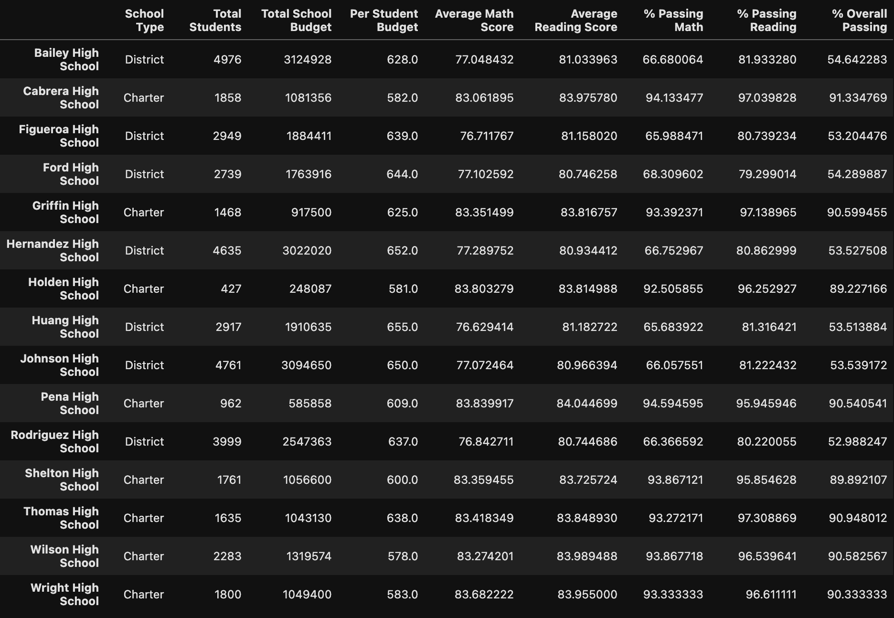
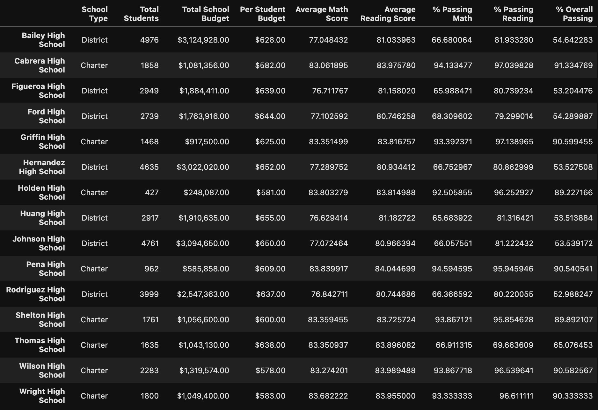

# School Data Analysis
### Overview
* After completion of the school district analysis we were informed of academic dishonesty from the 9th grade class at one High School. After replacing the test scores with NaN (Not a number) we reprocessed the district analysis to be able to display our analysis. 

## Results

#### District Analysis
  

* Look at the figures above, our analysis shows a drop (although not too big) in our district averages in math. Changing the grades from what they were to NaN our analysis counts the students but not the grade, therefore bringing our district average down.

### Thomas High School Analysis (compared to other schools)

  #### Before Changing 9th grade scores

#### After Changing 9th grade scores

* Looking at Thomas High School, the overall passing percentage (% Overall Passing) has dropped by over 25%.
Relative to the other schools in the district it has moved from being the 2nd highest in % Overall Passing to 8th (lowest of the charter schools).
 
##### How does replacing the ninth grade scores affect the following?
* In terms of math and reading scores by grade, for Thomas High School it completely removed their math average of a ~ 83% to Not a number (NaN).

*Looking at Score by School Spending, although it is not a big part of the district, the results of the academic dishonesty has caused the % Overall Passing to drop.

* In Scores by School Size as well as Scores by School Type, it made no significant effect.
 
 
## Summary
 ##### By replacing the Thomas High School 9th Grade score to NaN we see 3 main takeaways:

* It dropped Thomas High School from being #2 in terms of % Overall Passing to #8 in the district.

* Thomas High School is now at the bottom of Charter School rankings. 

* The 9th Grade class is too small relative to the district to make significant changes in our District Summary.
